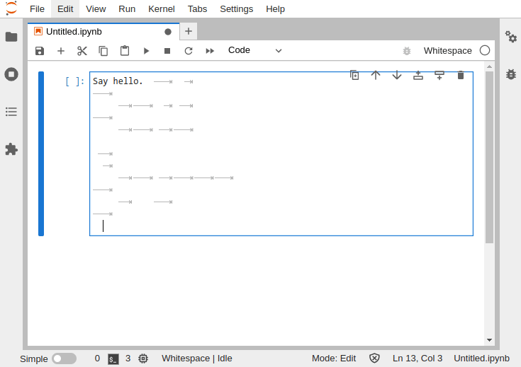

whitenote - The whitespace kernel for Jupyter
=============================================

`whitenote` is a [whitespace](https://web.archive.org/web/20150523181043/http://compsoc.dur.ac.uk/whitespace/index.php) kernel for [Jupyter](https://jupyter.org/).



## Try with Docker

Docker image avairable: [makiuchid/whitenote](https://hub.docker.com/r/makiuchid/whitenote)

```
docker run -p 8888:8888 makiuchid/whitenote
```

Follow the instructions on the screen to access Jupyter lab:
[http://localhost:8888/lab?token=????????](http://localhost:8888/)

## Install

### Required libraries

Ubuntu (focal, jammy), Debian (bullseye):
```
apt install libzmq3-dev libzmq5
```

### Build and install

```
git clone https://github.com/makiuchi-d/whitenote.git
cd whitenote
go install .
jupyter kernelspec install --name=whitenote --user ./kernel
```

## Whitespace interpreter

The whitespace interpreter (VM) is provided in the package `github.com/makiuchi-d/whitenote/wspace`.

### REPL binary

#### Install

```
go install github.com/makiuchi-d/whitenote/wspace/cmd/wspace@latest
```

#### Usage

```
wspace <file>
    Evaluate the file
wspace
    Launch an interactive interpreter
```
